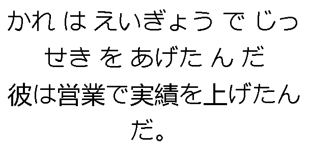
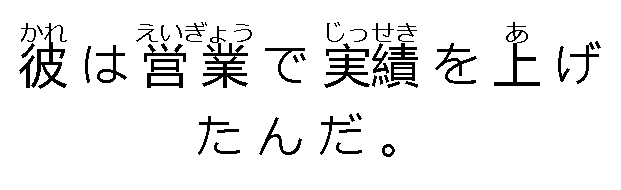

# Furigana Sewer

A tool that automatically adds furigana (reading guides) to Japanese text by aligning hiragana readings with kanji characters using diff algorithms to generate HTML ruby markup.

## Example

Input:

Reading: `かれ は えいぎょう で じっせき を あげた ん だ`
Expression: `彼は営業で実績を上げたんだ。`

Output: `<ruby>彼<rt>かれ</rt></ruby> は <ruby>営業<rt>えいぎょう</rt></ruby> で <ruby>実績<rt>じっせき</rt></ruby> を <ruby>上<rt>あ</rt></ruby> げたんだ 。`

| Input                      | Output:                  |
| -------------------------- | ------------------------ |
|  |  |

## Usage In Anki

```ts
// <p id=ruby></p>

function findLCS(s1, s2) {
  const n = s1.length;
  const m = s2.length;
  const dp = Array(n + 1)
    .fill(null)
    .map(() => Array(m + 1).fill(0));

  for (let i = 1; i <= n; i++) {
    for (let j = 1; j <= m; j++) {
      if (s1[i - 1] === s2[j - 1]) {
        dp[i][j] = 1 + dp[i - 1][j - 1];
      } else {
        dp[i][j] = Math.max(dp[i - 1][j], dp[i][j - 1]);
      }
    }
  }
  return dp; // Return the DP table for reconstruction
}

function getDiff(s1, s2) {
  const dp = findLCS(s1, s2);
  let i = s1.length;
  let j = s2.length;
  const diff = [];

  while (i > 0 || j > 0) {
    if (i > 0 && j > 0 && s1[i - 1] === s2[j - 1]) {
      diff.unshift({ type: "common", value: s1[i - 1] });
      i--;
      j--;
    } else if (j > 0 && (i === 0 || dp[i][j - 1] >= dp[i - 1][j])) {
      diff.unshift({ type: "added", value: s2[j - 1] });
      j--;
    } else if (i > 0 && (j === 0 || dp[i][j - 1] < dp[i - 1][j])) {
      diff.unshift({ type: "deleted", value: s1[i - 1] });
      i--;
    }
  }
  return diff;
}

function furiganaSewer(reading, experssion) {
  return getDiff(experssion, reading)
    .reduce(
      (acc, { type, value }) => (
        acc.at(-1)?.type === type
          ? (acc.at(-1).value += value)
          : acc.push({ type, value }),
        acc
      ),
      [],
    )

    .reduce(
      (acc, { type, value }) => (
        acc.at(-1)?.type === "deleted" && type === "added"
          ? (acc.at(-1).value =
              `<ruby>${acc.at(-1).value}<rt>${value}</rt></ruby>`)
          : acc.push({ type, value }),
        acc
      ),
      [],
    )

    .map(
      ({ type, value }) =>
        ({
          added: "" + value,
          common: value,
          deleted: "" + value,
        })[type],
    )
    .join(" ");
}

document.querySelector("#ruby").innerHTML = furiganaSewer(
  `{{Reading}}`,
  `{{Expression}}`,
);
```

## About

Furigana Sewer uses Longest Common Subsequence (LCS) algorithms to intelligently match hiragana readings with their corresponding kanji characters, then generates proper HTML `<ruby>` tags with `<rt>` annotations for web display. This approach handles complex Japanese text structures including mixed hiragana, katakana, and kanji combinations.
