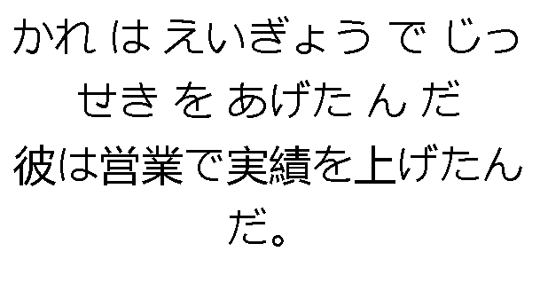
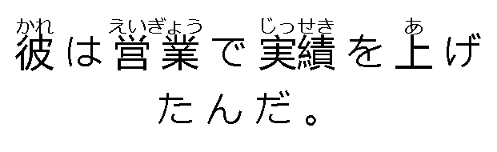

# Furigana Sewer

A tool that automatically adds furigana (reading guides) to Japanese text by aligning hiragana readings with kanji characters using diff algorithms to generate HTML ruby markup.

## Example

Input:

Reading: `かれ は えいぎょう で じっせき を あげた ん だ`
Expression: `彼は営業で実績を上げたんだ。`

Output: `<ruby>彼<rt>かれ</rt></ruby> は <ruby>営業<rt>えいぎょう</rt></ruby> で <ruby>実績<rt>じっせき</rt></ruby> を <ruby>上<rt>あ</rt></ruby> げたんだ 。`

Input:

Output:

## About

Furigana Sewer uses Longest Common Subsequence (LCS) algorithms to intelligently match hiragana readings with their corresponding kanji characters, then generates proper HTML `<ruby>` tags with `<rt>` annotations for web display. This approach handles complex Japanese text structures including mixed hiragana, katakana, and kanji combinations.
